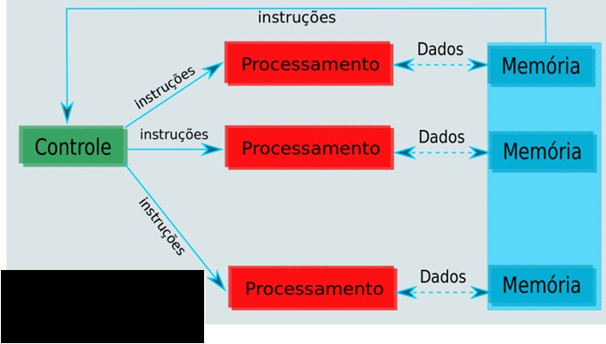
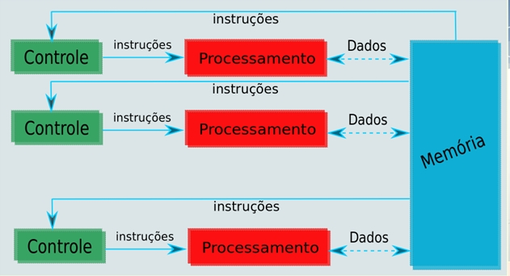
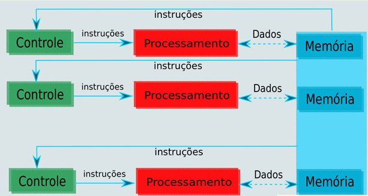
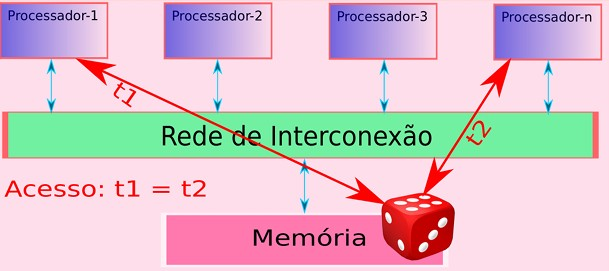
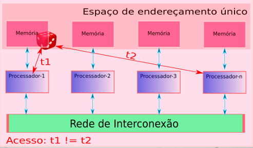
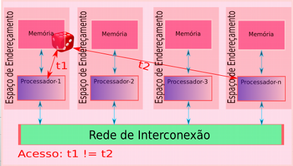
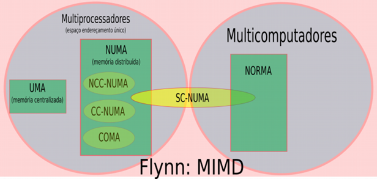
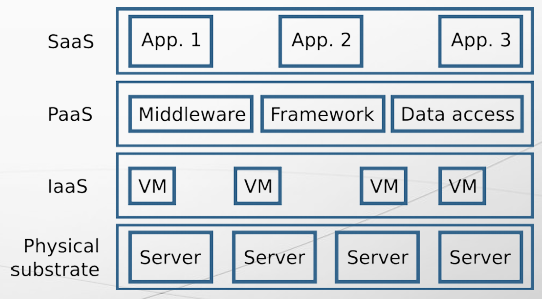
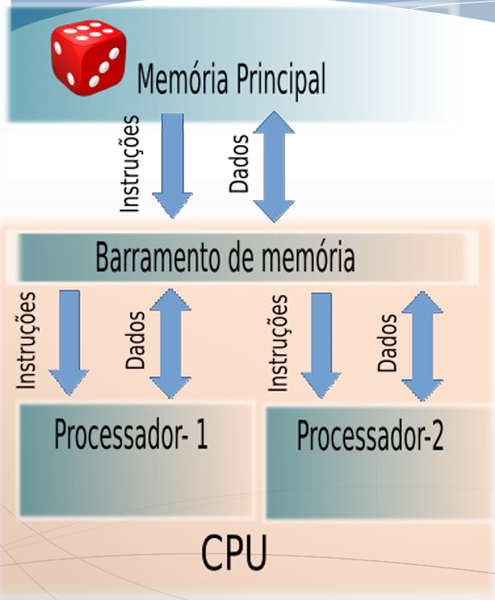
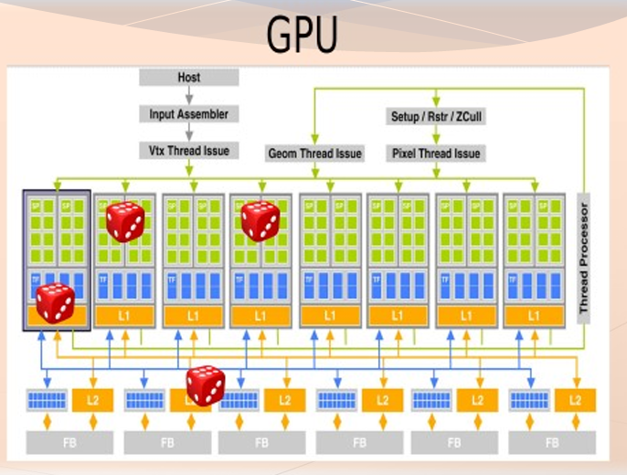

# Classificação de Arquiteturas Paralelas

## Classificação - Fluxo de instruções e dados (MIMD & SIMD)
Classificação de Flynn (1972), a execução de um programa pode ser modelada como um fluxo de instruções que executam em um processador.

> Instruções que operam sobre dados.

Em 1966, **SISD (Single-Instruction Single-Data)** foi aplicada para definir um computador monoprocessado. Com o mesmo princípio, um computador que executa múltiplas instruções em múltiplos dados foi classificado de **MIMD (Multiple-Instruction Multiple-Data)**.

Nesta visão, um computador é constituído por:
- Unidade de Controle (UC) que gerencia as instruções;
- Unidade de Processamento (P) que efetivamente processa dados e instruções;
- Memória (M) que armazena dados e instruções.

|    | SD   | MD   |
|----|------|------|
| SI | SISD | SIMD |
| MI | MISD | MIMD |

- `SISD` (Single-Instruction Single-Data), *máquinas Von Neumann\** (convencionais).
> A *Máquina de Von Neumann\** é o modelo conceitual fundamental da maioria dos computadores modernos, proposto em 1946 por John von Neumann. Sua principal característica é a arquitetura de programa armazenado, onde dados e instruções (programas) residem na mesma memória principal, sendo processados sequencialmente através de ciclos de busca, decodificação e execução.

  
  <figcaption>Classificação de Flynn: SISD.</figcaption>

- `SIMD` (Single-Instruction Multiple-Data), *máquinas vetoriais\**.
> As *Máquinas Vetoriais\** são sistemas de computação de alto desempenho, populares entre as décadas de 1970 e 1990, projetados para processar grandes conjuntos de dados (vetores) com uma única instrução (SIMD - Single Instruction, Multiple Data). Diferente de processadores convencionais, eles utilizam pipelines para realizar operações matemáticas complexas em vetores inteiros de uma vez, sendo ideais para simulações científicas.

  
  <figcaption>Classificação de Flynn: SIMD.</figcaption>

- `MISD` (Multiple-Instruction Single-Data), sem representantes/controvérsias.

  
  <figcaption>Classificação de Flynn: MISD.</figcaption>

- `MIMD` (Multiple-Instruction Multiple-Data), *multiprocessadores\** e *multicomputadores\**.
> Os *Multiprocessadores\** compartilham uma única memória central entre várias CPUs, ideal para compartilhamento de dados. Já os *Multicomputadores\** possuem memória privada para cada processador, comunicando-se via rede (mensagens). Multiprocessadores focam em alta velocidade de acesso, enquanto multicomputadores focam em escalabilidade.

  
  <figcaption>Classificação de Flynn: MIMD.</figcaption>

## Classificação - Tempo de acesso a memória

### Classificação UMA - Uniform Memory Access
Latência de acessoa à memória é igual a todos os processadores, possui endereçamento único.

> Problema: Memórias cache (sincronização e coerência).

  
  <figcaption>Classificação UMA.</figcaption>

### Classificação NUMA - Non-Uniform Memory Access
Cada processador tem seu(s) módulo(s) de memórias e possuem endereçamento único.

  
  <figcaption>Classificação NUMA.</figcaption>

### Classificação NORMA - Non-Remote Memory Access
Multicomputadores, processadores com acesso privado a memória, com espaços de endereçamento distintos (único por processador).

Apresentam subdivisões NUMA de acorodo com a coerência de cache:
- **NCC-NUMA:** Sem coerência de cache
- **CC-NUMA:** Com coerência de cache em hardware
- **SC-NUMA:** Com coerência de cache em software
- **COMA:** Somente com cache 
- 

  
  <figcaption>Classificação NORMA.</figcaption>

### Taxonomia - Tempo de acesso a memória

  
  <figcaption>Taxonomia.</figcaption>

# Máquinas Paralelas
## Aglomerado (Clusters)
Aglomerado é um tipo de sistema de processamento paralelo e distribuído, o qual consiste de uma coleção de computadores (nós) stand-alone interconectados, que cooperam trabalhando juntos como um único supercomputador, com recursos de computação integrados.

> Nó ou nódulo é um computador mono ou multiprocessado independente com sistema de memória, E/S e sistema operacional.

**Classificação em função do tipo do Hardware:**:
- Aglomerado de PCs - CoPs (Clusters of PCs), PoPs (Piles of PCs)
- Aglomerado heterogêneo - COWs (Clusters of Workstations)
> NOW - Network of Workstation, aglomerado de vários computadores para ter o poder de processamento de um MainFrame.
- Aglomerado de SMPs - CLUMPs (Clusters of SMPs)

**Classificação em função do sistema de gerência:**
- Aglomerado Homogêneo: Todos os nós possuem a mesma arquitetura de hardware e sistema operacional.
- Aglomerado Heterogêneo: Nós possuem arquieteturas, características ou fabricantes de hardwares distintos e/ou sistema operacionais também distintios.

> Cluster == Datacenter, onde cada cluster é homogêneo.

## Grade (Grid)
Grid, ou Grades Computacionais, é um tipo de sistema paralelo e distribuído que permite o compartilhamento, troca e seleção, agregando recursos autônomos geograficamente distribuídos.

O sistema passa a depender da disponibilidade, capacidade, custo e requisitos de QoS do usuário.

Recursos compartilhados aplicados a uma solução de um problema coordenado em uma organização virtual multi-institucional dinâmica.

> Pode se fazer um paralelo de um Grid sendo a mesma coisa que Datacenter Distribuído ou **Cloud**.

## Nuvem Computacional (Cloud Computing)
Nuvens Computacionais introduziram uma nova forma de entrega de serviços de TI, baseada na diminuição de custos, escalabilidade e aprovisionamento sob demanda, guiado pelos requisitos dos usuários. Possui um motivador tecnológico na virtualização de recursos computacionais.

- Flexibilidade
- Elasticidade
- Economia
- Simplificação de infraestruturas de TI

### Tecnologia de Virtualização
A virtualização de um recurso consiste na desmaterialização de sua capacidade física e funcional, e em sua representação através de entidades e serviços virtuais. São exemplos a criação de máquinas virtuais, que atuam como recursos físicos e a criação de canais de comunicação virtuais que abstraem o veradedeiro caminho físico.

- Melhor utilização dos recursos físicos
- Possibilidade de reconfiguração rápida
- Mobilidade
- Segurança, abstração, acesso controlado
- Diminuição de custos administrativos
- Redução de custos com consumo de energia e gerenciamento

### Tipos de Nuvens
- **Nuvens Privadas:** Possuem recursos internos de uma organização, usualmente os administradores possuem total controle sobre os recursos, além de possuírem uma maior confiabilidade e confidencialidade. Uso controlado.
- **Nuvens Públicas:** Recursos são explorados sob a forma de serviços que podem ser comercializados, os recursos são geograficamente distribuídos. Possuem acesso via Internet.
- **Nuvens Híbridas:** Combinação de Nuvens Privadas e Públicas, possuem picos de execução, aumento de carga momentânea e aumento do número de usuários.

### Modelos de Serviço:
- **Software como serviço (Software as Service - Saas):**
  - Mais alto nível de abstração.
  - Permite a execução de aplicações que estão alocadas em servidores remotos, usualmente virtualizados.
  - Alguns exemplos são Microsoft Online, Salesforce.com, Rackspace, SAP Business ByDesign, Google Apps, NetSuite.
- **Plataforma como serviço (Platform as a Service - PaaS):**
  - Oferece frameworks que permitem o desenvolvimento de aplicações, são exemplos de ferramentas como desenho, modelagem, desenvolvimento, testes e integração.
  - Nâo requer instação local de ferramentas.
  - Gerenciamento automático da escalabilidade;
  - Alguns exemplos de provedores são Google App Engine, Microsoft Windows Azure e Force.com.
- **Infraestrutura como serviço (Infraestructure as a Service - IaaS):**
  - Oferece máquinas virtuais como serviços sob demanda.
  - Atualmente, MVs são interconectadas usando abordagem best-effort.
  - Alguns exemplos de provedores são  Amazon EC2, GoGrid, Rackspace e Flexiscale.

  
  <figcaption>Saas, PaaS, IaaS.</figcaption>

## Coprocessadores & Aceleradores Gráficos
Um coprocessador é um processador de computador com funções suplementares utilizado para auxiliar o processador principal (CPU).
> Coprocessadores podem ser usados para funções especialziadas, e.g aritmética de pontos flutuantes, processamento gráfico, processamento de sinais.

  
  <figcaption>CPU</figcaption>

Aceleradores Gráficos são coprocessadores em forma de placas gráficas, bastante comuns em computadores modernos, chamados de GPU (Graphics Processor Units).

  
  <figcaption>GPU</figcaption>

A ponte entre CPU e GPU é o PCIe.

### Evolução da Artitetura de GPU
- **Pipeline Gráfico**: Propósito específico, sendo esses as operações de vértices, primitivas de montagem, rasterização, operações de fragmentos, composição.
- Hardware para processar as operações específicas de vértices e fragmentos precisam ser mais complexos.
- CPUs dividem seu pipeline em *passos de tempo\**, enquanto GPUs em *passos de espaços\**.
> **Passo de Tempo (Time Step)** é quando o tempo avança por iteração em uma simulação ou cálculo, exemplo `dt = 0.01s`, avanço temporal por ciclo. Já o **Passo de Espaço (Space Step)** é o tamanho da divisão do espaço em uma grade/malha usada para resolver um problema, como dividir o espaço em células de `dx = 0.1 m`, resolução espacial da malha.

---

### Notes
1. *Utilizar linha do tempo para contextualização histórica, uso de marcos temporais.*
2. [Grid5000](www.grid5000.fr), grid acadêmico.