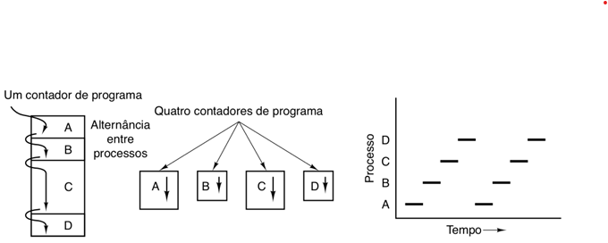
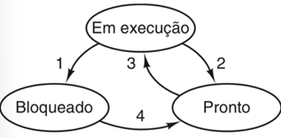
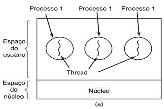
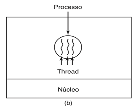
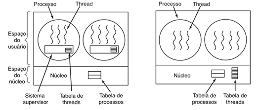

# Revisão de Processos
*Sistemas Operacionais: Conceitos e Mecanismos - Livro*

Um processo é um programa em execução.
- Registradores, contador de programa e pilha.
- Cada processo enxerga uma CPU virtual.

Cada processo possui sua tabela de controle e não deveriam permitir o compartilhamento de memória entre processos.

> Podem existir pequenos buffers de memória mapeados para compartilhamento entre processos.

Um binário, quando executado, ocupa um espaço em RAM e na CPU, e compartilha cache, o processo criado, quando o binário é executado, performa movimentos de dados entre RAM e CPU através da memória cache.

## Multiprogramação

Troca de contexto, salva o contexto, porém é lento, então o objetivo é diminuir a troca de contexto, assim surge a Multiprogramação.

A Multiprogramação, são vários processos carregados na memória ao mesmo tempo.
- Máquinas monoprocessadas, apenas um processo executa de cada vez, possui pseudoparalelismo.

<div style="text-align: center;">
  
  <figcaption>Multiprogramação de quatro processos.</figcaption>
</div>

> Processos não devem fazer hipósteses temporais ou sobre a ordem de execução. Porém existem primitivas de sincronização para garantir que certos processos iniciem antes ou depois.

- Máquinas multiprocessadas, possuem paralelismo real.

## Criação de Processos
OS, deve invocar processos e compartilhar recursos entre processos.

> Sistema Operacional (OS) de propósito geral: Windows, Linux e Mac.

No Unix (Linux), processos são criados através da chamada `fork`.

O processo filho é idêntico ao processo pai:
- O código e dados são copiados.
- Diferença está no valor de retorno de função.
- A chamada `exec` substitui o processo corrente.

```C
pid = fork();
if (pid == 0)   /* processo filho */
    execv("/bin/prog", args);
else            /* processo pai */
    w = waitpid(pid, &status, 0);
```

Na formação de hierarquias de processos, os processos "procriam" por várias gerações, um processo pai cria processos filhos, que por sua vez também criam seus filhos, *ad nauseam*.

Chamadas "grupos de processsos" no Unix, são sinalizações de eventos se propagam através do grupo, e cada processo decide o que fazer com o sinal (ignorar, tratar ou "ser morto"), todos os processos Unix descendem de `init`.

> Windows não possui hierarquias de processos, todos os processos são criados iguais.

## Estado de um processo
Um processo pode assumir diversos estados no sistema:
- **Em execução**: Processo que está usando a CPU.
- **Pronto**: Processo temporariamente parado enquanto outro processo executa, fila de prontos (aptos).
- **Bloqueado**: Esperando por um evento externo.

<div style="text-align: center;">
  
  <figcaption>Multiprogramação de quatro processos.</figcaption>
</div>

Processos entram no sistema na fila de prontos, e suas transições dependem de interrupções para sinalizar condições.

Políticas de escalonamento, garantir que todos os processos sejam processados.

As informações sobre os processos do sistema são armazenadas na tabela de processos, onde cada entrada é chamada de **descritor de processos** ou **bloco de controle de processo**.

## Processos Leves (Threads)
Processos possuem, um espaço de endereçamento (espaço de memória), onde há um fluxo de execução. Ou seja, um processo singular, compartilha memórias entre diversos fluxos de processamento.

Processos agrupam recursos, que facilita o gerenciamento.

A thread representa o estado atual de execução, um contador de programa, registradores, pilha.

Múltiplas threads em um processo permitem execuções paralelas sobre os mesmos recursos, análogo a vários processos em paralelo.

<div style="text-align: center;">
  
  <figcaption>3 processos com 1 thread.</figcaption>
</div>

<div style="text-align: center;">
  
  <figcaption>1 processos com 3 threads.</figcaption>
</div>

As várias threads de um processo compartilham muitos dos recuros do processo, ou seja, não existe proteção de memória entre threads. Além disso, possibilitam soluções paralelas para problemas, cada thread sequencial se preocupa com uma parte do problema, que é interessante em aplicações dirigidas a eventos.

No quesito desempenho, criar e destruir threads é mais rápido, o chaveamento de contexto é muito mais rápido e é possível combinar threads *I/O-bound\** e *CPU-bound\**.
> Threads **I/O-bound** é quando o gargalo é a esperada de alguma entrada/saída, como por exemplo, ler arquivos de disco, fazer requisições HTTP, consultar banco de dados, esperar resposta de hardware. Threads **CPU-bound** é quando o processamento é o gargalo, como por exemplo, treinar rede neural, criptografia, processamento de imagem e simulações numéricas. Em suma, CPU-bound trava pela CPU e I/O-bound trava por espera externa.

### Processador de texto com 3 threads
Considerando um processador de texto com 3 threads no mesmo processo, garante a eficiência na movimentação da memória, neste caso cada thread precisa da sua própria pilha, sendo assim o histórico de execução e as váriaveis locais são mantidos.
<div style="text-align: center;">
  
  <figcaption>Threads e pilhas.</figcaption>
</div>

### Implementação de Threads
**Threads implementadas por biblioteca**, e o núcleo não sabe nada sobre elas, sendo assim `N` threads são mapeadas em um processo `(N:1)`, o núcleo escalona processos e não threads, sendo assim o *escalonamento de threads\** é feito pela biblioteca.
> O **escalonamento de threads** é o processo de decidir qual thread será processada.

- Permite usar threads em SOs que não tem suporte.
- Chaveamento de contexto entre threads não requer chamada de sistema -> desempenho.
- *Preempção por tempo\** e o tratamento de chamadas bloqueantes é complicado.
> Preempção por tempo é quando o sistema operacional interrompe uma thread automaticamente após um tempo pré-definido, mesmo que ela ainda não tenha terminado.

**Threads implementadas no núcleo**, núcleo conhece e escalona as threads, sendo assim não há necessidade de biblioteca, modelo passa a ser `1:1`.
- Facilidade para lidar com chamadas bloqueantes
- Preempção entre threads.
- Há maior custo em operações envolvendo threads, pois exigem chamadas ao núcleo.

<div style="text-align: center;">
  
  <figcaption>Implementação de Threads.</figcaption>
</div>

Existem alguma **preocupçaões ao converter códigos sequenciais**:
- Variáveis globais modificadas por várias threads, sendo assim é proibido o uso de variáveis globais, porém sendo permitido o uso de variáveis globais privatias de cada thread.
- Bibliotecas não reetrantes, funções que não podem ser executadas por mais de uma thread, ou seja, que é permitido apenas uma execução por vez..
- Captura de sinais.
- Gerenciamento da pilha, o sistema precisa tratar *o overflow de várias pilhas\**.
> Cada thread possui sua própria pilha, um espaço de memória usado para variáveis locais, chamadas de função e retorno. O gerenciamento da pilha, garante que cada thread tenha sua pilha isolada, protegida e que o overflow seja detectado sem quebrar o sistema.

# Operações em Matrizes na Linguagem C
*Programação Multithread: Modelos e Abstrações em Linguagens Contemporâneas - Livro*

`PCAM` (Partitioning, Communication, Agglomeration and Mapping) define as etapas para realização de um projeto paralelo, com objetivo de se obter os melhores resultados possíveis.

main.c - Cria alocação de memória em alocação dinâmica.

[main.c](../4_repos/c_cpp/2_matrizes_c/main.c)
```C
matriz_t *A = NULL;
```
Ler de trás para frente, A é um ponteiro de `matriz_t`.

[matriz.c](../4_repos/c_cpp/2_matrizes_c/matriz.c)
```C
retorno->linhas = linhas;
(*retorno).colunas = colunas;
```
`retorno->` e `(*retorno).` são maneiras de representar a mesma coisa.

```C
double *temp = NULL;
temp = (double *) malloc(linhas * colunas * sizeof(double));
retorno->dados = (double **) malloc(linhas * sizeof(double *));
```
A definição de `double *temp = NULL` cria um espaço na memória para alocar uma matriz de dados tipo `double`, ainda não aponta para memória válida.

A segunda linha, `temp = ...`, aloca um bloco de memória suficiente para armazenar `linhas * colunas` de valores do tipo `double`.
A função `malloc(...)` pede ao sistema um bloco de memória do tamanho solicitado e retorna o endereço inciail dessa memória. Por fim, `(double *)` converte o ponteiro retornado para o tipo `double *`, assim `temp` aponta para um **array linear** de `double`, com tamanho total de `linhas * colunas`.

Na terceira linha, está sendo alocada a estrutura das linhas de uma matriz 2D. O campo retorno->dados é um *ponteiro para ponteiro\** de double `(double**)`, em C, uma matriz 2D é geralmente representada como vetor de ponteiros para linhas.
A chamada `malloc(linhas * sizeof(double *))` aloca memória para um array com `linhas` ponteiros, onde cada ponteiro representará o início de uma linha da matriz, ou seja:
```C
retorno->dados[0] // Ponteiro para linha 0
retorno->dados[1] // Ponteiro para linha 1
// ... assim em diante
```

```C
int i;
for (i = 0; i < linhas; i++) {
    retorno->dados[i] = &temp[i * colunas];
}
```
Para cada linha da matriz, `&temp[i * colunas]` retorna o endereço dentro do bloco contínuo `temp`, onde essa linha começa e então guarda o endereço em `dados[i]`.

> Ponteiro para ponteiros, um ponteiro normal `(double *)` guarda o endereço de um double. Já um ponteiro para um ponteiro `(double **)` guarda o endereço de um ponteiro. Isso permite representar matrized 2D, `double *` uma linha e `double **` um vetor de ponteiros para linhas.

Em C não existe array dinâmico real, porém `malloc` cria um bloco contínuo de memória que pode ser utilizado como array. A linha de código abaixo aloca memória para um array de ponteiros.

```C
retorno->dados = (double **) malloc(linhas * sizeof(double *));
```

Assim, `retorno->dados` se torna um pointeiro para ponteiros, que pode ser acessado como um array (de ponteiros para `double`).

Sendo assim, para acessarmos linhas e colunas, podemos fazer `retorno->dados[i][j]`, se não tivéssemos esse array de pointeiros, teríamos que acessar `temp[i * colunas + j]`. Porém, em C, a expressão `p[i]` pode ser definida como:

```C
p[i]  ==  *(p + i)
```

Isso é afirmado na *ISO C Standard*. O operador `[]`  não tem semântica própria, ele é simplesmente uma notação sintática para desreferenciar um endereço computado por *aritmética de ponteiro\**.

## Aritmética de ponteiros
Em C, a expressão `p + i`, sendo `p` um ponteiro, produz um ponteiro cujo valor é `addres(p) + i * sizeof(TYPE)`, onde TYPE é o tipo apontado por `p`. Essa operação é definida no padrão como aritmética escalada, executada em unidades do tipo apontado. Essa equivalência é crítica porque define a linearização da memória.

Se `p` aponta para uma região contígua, `[i]` acessa `*(base_address + i * element_size)`.

Em suma, `p[i] ::= *(p + 1)` com aritmética escalada por sizeof(*p).

## Compiladores e Performance
Utilizar o `make`, existem algumas possibilidades para otimização, por exemplo, utilizando o `gcc` com *flags* de otimização, como mostrado abaixo:
```bash
gcc -Wall -O0 matriz.c main.c -o exe_0
gcc -Wall -O1 matriz.c main.c -o exe_1
gcc -Wall -O2 matriz.c main.c -o exe_2
gcc -Wall -O3 matriz.c main.c -o exe_3
gcc -Wall -Ofast matriz.c main.c -o exe_fast
```
> `-O2` é o padrão do compilador, porém em alguns casos pode ser `-O0`.

Executável com pg, instrumenta o código para verificar a quantidade de tempo utilizada.
```bash
gcc -Wall -pg matriz.c main.c -o exe_pg
./exe_pg
gprof exe_pg
```

Essas ferramentas servem para enteder qual instrução do código está demorando mais tempo para ser processada.

MPI_Scatter
> prompt: Preciso de um bloco de memória para usar com MPI (MPI_Scatter).

---

TLB, é implementado em hardware para mapear a memória para o uso compartilhado por diversos processos, compartilhamento virtual da memória.

> Ataques provenientes da TLB, pois ao descobrir qual parte da memória está sendo utilizada pelo processo, restringe-se a busca na memória.

*Implementar servidor apache\**

Ferramenta *Airflow\**


