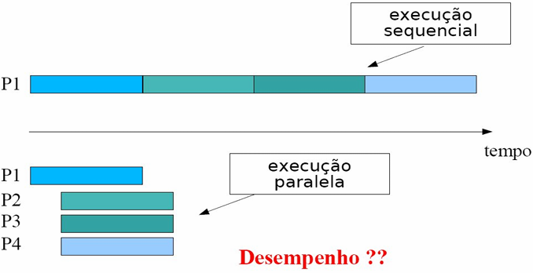
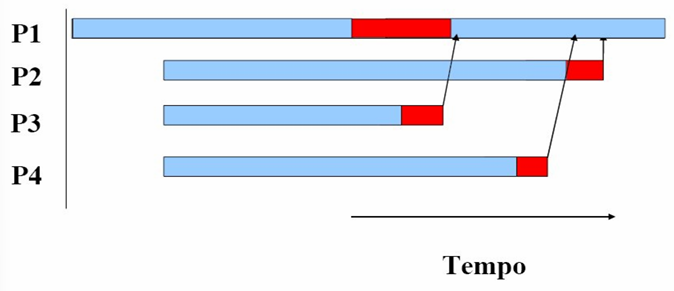
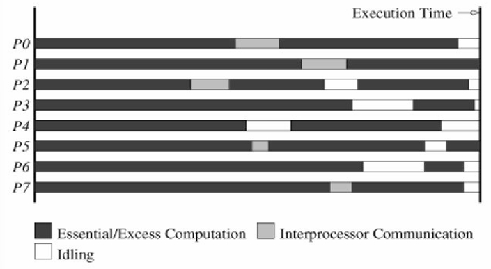
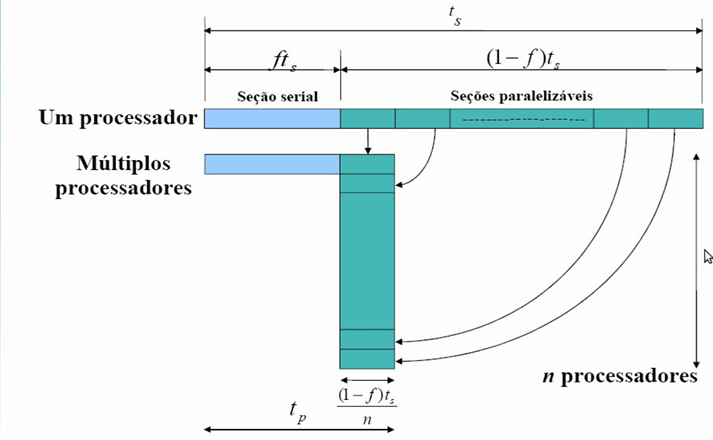

# Avaliação de Desempenho de Programas Paralelos
Mensurar o impacto do paralelismo sob uma determinada aplicação/algoritmo
- Aceleração
- EficiÊncia
- Escalabilidade

Algoritmo sequenciais são avaliados em função de seus tempos de execução, normalmente expressos em função do tamanho da sua entrada.

*Usando-se duas vezes mais recursos de hardware espera-se que um programa seja executado duas vezes mais rápido!* - Falácia, em programas paralelos isto raramente acontece devido a perdas 
associadas (overheads) com o paralelismo.

## Overhead de Paralelismo
Deve-se evitar a sincronização de dados, pelo aumento significativo da sobrecarga. A sincronização deve ser feita na região crítica, quando se deve ter certeza do resultado final, determinístico.

Tempo para terminar uma tarefa, um computador precisa estar sincronizado com os outros computadores, avisar que finalizou a tarefa.

```C
LER X;
X+=1;
ESCREVER X;
```

O sistema operacional pode fazer a preempção de qualquer código, alternar o contexto das threads, ou seja, se duas threads estiverem executando esse trecho de código a cima, a memória de X é compartilhada, e não há como saber qual o valor escrito no final das execuções, se X+1 ou X+2.

```C
LOCK(Y)
LER X;
X+=1;
ESCREVER X;
UNLOCK(Y)
```

Mesmo com `LOCK` e `UNLOCK` (mutex), não é possível resolver esse problema por software, pois as funções `LOCK` e `UNLOCK` se implementadas, também leem, modificam e escrevem.

O **hardware** resolve esse problema através da CPU, com instruções para bloquear momentaneamente regiões da memória.

## Execução Sequencial x Paralela

<div style="text-align: center;">
  
  <figcaption>Sequencial x Paralela.</figcaption>
</div>

P1, criará as threads P2, P3, e P4, por isso há a um tempo entre o início de P1 e as outras threads.

### Fontes de Perdas
Uma fonte de peras é a **interação entre processos**, qualquer sistema paralelo não trivial necessita que suas tarefas interajam (comunicação). Uma definição é que as threads, pela hierarquia, esperam a finalização das threads filhos, essa informação é obtida através de um tempo gasto em comunicações de dados.

<div style="text-align: center;">
  
  <figcaption>Fontes de perda.</figcaption>
</div>

Na imagem abaixo, são 8 hardwares independentes, paralelos reais. Nesse tipo de aplicação, é impossível predizer o tamanho das subtarefas.
<div style="text-align: center;">
  
  <figcaption>Fontes de perda.</figcaption>
</div>

Uma outra fonte de perdas é a osciosidade de processadores, que acontece pelo desbalanceamento de carga, sincronização e a presença de componentes seriais em um programa.

## Tempo de Execução
- **Tempo de execução serial (Ts)**, é o tempo decorrido entre o início e o final de sua execução em um computador sequencial.
- **Tempo de execução paralelo (Tp)**, é o tempo transcorrido entre o início de uma computação paralela até o término do último elemento de processamento.

A aceleração (speedup), é dado por `S(n) = Ts/Tp`.

<div style="text-align: center;">
  
  <figcaption>Fontes de perda.</figcaption>
</div>

**Amdahl's law**, toda aceleração é limitado pela parte (fração) serial.

**Gustafson's law**, foi uma análise da lei de Amdahl considerando **escalabilidade**. Nela é considerado que o tempo de execução paralela é fixo, assim como ft.
- A parte serial é fixa sendo independete da carga.
- Pode-se resolver problemas maiores no mesmo intervalo de tempo.

## Considerações Finais
Teoricamente, o speedup nunca pode exceder o número de elementos de processamento p. Porém, na prática ocorre o fenômeno conhecido como superlinear speedup.
- O trabalho realizado por um algoritmo sequencial é maior que sua formulação paralela.
Somente um sistema paralelo ideal contendo p elementos de processamento pode fornecer um speedup igual a p. Porém, na prática não é atingido pois os elementos de processamento 
não dedicam 100% de tempo para a execução do programa.

# PCAM: Particionamento, Comunicação, Aglomeração e Mapeamento
PCAM:
- **P**articionamento: Identificar oportunidades para execução paralela, colocando em vista a decomposição do problema em subproblemas.
  - Decomposição dos dados em pequenas partições de tamanhos semelhantes.
  - Decomposição das operações de acordo com o particionamento dos dados.
  - Tarefas resultantes: associação de partições de dados e operações associadas.
  - Comunicação entre tarefas.
  - Decomposição funcional, onde cada tarefa executa cálculos diferentes para resolver um problema. Essas tarefas podem ser executadas sobre os mesmos dados ou dados distintos.
- **C**omunicação: Comunicação precisa ser minimizada, escolha entre troca de mensagens e memória compartilhada.
  - Local x Global
  - Estruturada (árvores, grade) x Não-estruturada (grafos arbitrários)
  - Estática x Dinâmica
- **A**glomeração: Reduzir as comunicações, aumentar a granulosidade, ou seja a razão entre a quantidade de computação e a quantidade de comunicação, preservando o paralelismo.
  - Pode resultar em replicação de dados e/ou operações.
  > Quanto mais fina a granulosidade menor a aceleração.
- **M**apeamento: Alocação de tarefas aos processadores disponíveis, tarefas independentes em processadores diferentes ou tarefas com dependências no mesmo processador.
  - Distribuição de carga, mapeamento equitativo de tarefas considerando a capacidade do processador.
  - Mapeamento estático, definido no início da execução, conhecendo o problema.
  - Mapeamento dinâmico, que segue um balanceamento dinâmico.

O particionamento é a etapa incial, nessa etapa é feita a identificação de oportunidades para execução paralela. Como também, a decomposição do problema em subproblemas. É muito importante pensar no equilíbrio e balanceamento da carga.

## Exemplo
Multiplicação de matrizes

Os dados da matriz são enviados via serial para uma máquina e salvos na memória, em S1.

```
(A, B, C) 
|  //SERIAL
[P1, P2, P3, P4] // S1
| // REDE
[P1, P2, P3, P4] // S2
| // REDE
...
| // REDE
[P1, P2, P3, P4] // SN
```

### Particionamento

1. Matriz completa
2. Célula da matriz
3. Linha
4. Coluna
5. **Bloco de linhas**
6. Bloco de colunas

Utilizar linhas pode ser um bom approach, porém existem linhas que podem ser resolvidas mais rápido que outras, por isso, são utlizados bloco de linhas para balancear a carga.

### Comunicação
1. Local x Global
2. Estruturada x Não-estruturada
3. Estática x Dinâmica
### Aglomeração

### Mapeamento

# [pthreads_matrix_mult](../4_repos/c_cpp/3_pthreads_matrix_mult/)

[pthreads_matrix_mult.c](../4_repos/c_cpp/3_pthreads_matrix_mult/pthreads_matrix_mult.c)
```bash
for i in `seq 4 24`; do \pthreads_matrix_mult $i 3000; done
```

---
## Assignment W15
1. Resolver a questão de número 5, sem código, somente o planejamento.
2. Entender o código [pthreads_matrix_mult](../4_repos/c_cpp/3_pthreads_matrix_mult/)