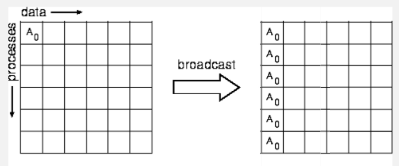

# Programação com MPI

## Modelos
Um processo pode ser completamente diferente do outro.

- SPMD: Single Program Multiple Data
  - Existe somente um programa, e esse único programa executa em diversos hosts sobre um conjunto de dados distintos.
- MPMD: Multiple Program Multiple Data
  - Existem diversos programas, que executam em hosts distintos.
  - Cada máquina possui um programa e um conjunto de dados distintos.

Pipeline de execução, ex:
1. Obtem imagem
2. Pre-processa
3. Visualiza

## Criar processo
- **Criação Estática**
- Criação Dinâmica

## Troca de mensagens
- Síncrono
- Assíncrono

## MPI
- Padrão definido em 1994 pelo MPI Fórum
- Utiliza a troca de mensagens entre processos

teste.c
```C
#include <stdio.h>
#include <mpi.h>

int main (int argc, char *argc[])
{
    MPI_Init(&argc, &argv);
    printf("Ola\n");
    MPI_Finalize();
    return 0;
}
```

`MPI_Init` faz o mapeamento automático de `id`, `ip/port`.

hosts.txt
```
ens1
ens2
ens3
ens4
ens5
```

```
mpicc teste.c -o teste
mpirun --machinefile host.txt teste
```

[MPI Examples: Example 1](../4_repos/c_cpp/7_mpi_examples/ex1.c)
- `MPI_Comm_rank(MPI_COMM_WORLD, &rank);`, quem sou eu no grupo.
- `MPI_Comm_size(MPI_COMM_WORLD, &size);`
- `MPI_Bcast()`, todos que pertencem ao grupo, recebem a mensagem. É uma linha bloqueante, porém eficiente para passar informação. (lembra um thread.join())
- `if (rank==0)`, verifica se é o mestre.

Nunca podemos fazer alguma definição sobre a ordem da execução.

[MPI Examples: Example 2](../4_repos/c_cpp/7_mpi_examples/ex2.c)
- `MPI_Send(...)` e `MPI_Recv(...)`, envia e aguarda mensagens.
- **tag** administrativa e **tag** de dados trafegando.

### Comunicação em grupo Broadcast
MPI faz a decomposição e agrupamento de dados
<div style="text-align: center;">
  
  <figcaption>Decomposição.</figcaption>
</div>

O processo 0, possui dado A0, em uma chamada *broadcast* ele passa o dado para todos.

<div style="text-align: center;">
  
  <figcaption>Agrupamento.</figcaption>
</div>

Somente o mestre carrega os dados, os outros apenas declaram, o mestre atribui.

- `MPI_Scatter(...)`, todos executam a linha, quando o mestre executar, decompõe o vetor e entrega um MPI_INT (ou outro tipo da variável), para cada um dos participantes, que recebem em suas respectivas posições (de forma automática).


### Troubleshoot
1. Utilizar rede específica:
    ```
    mpicc teste.c -o teste
    mpirun --machinefile host.txt teste  -mca btl_tcp_if_include 10.20.221.0/224
    ```
    `-mca`, configuração avançada para utilizar o TCP em uma rede específica

2. `ssh ens1` para verificar a autenticação.
