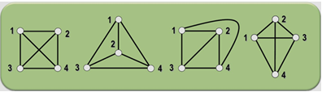
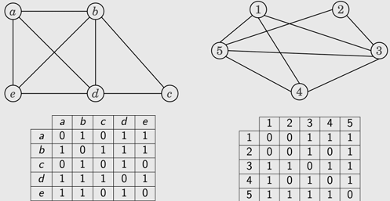

# Questão 5
Utilize a metodologia PCAM para identificar alternativas para o seguinte problema (use a arquitetura da questão 3 como alvo para execução). Não é necessário implementar o código.

> Questão 3. Arquitetura: Um aglomerado composto por 6 servidores Dell PowerEdge R720, cada um equipado com Intel Xeon E5-2620 v3 (Haswell 2.40GHz, 2CPUs/node, 6 cores CPU), 128 GB RAM, armazenamento 278 GB HDD SCISI PERC H330. Os servidores são interconectados por duas redes: (a) eth0/eno1, Ethernet, 10 Gbps; e (b) InfiniBand, 56 Gbps, modelo Mellanox Technologies MT27500 Family [ConnectX-3]. Por fim, cada servidor possui duas NVIDIA Titan Black (CUDA cores: 2880, memória 6144 MB com vazão de 288.4 GB/s, warp size: 32, número máximo de threads por bloco: 1024).

Definição do problema: Dois grafos, G e H, são isomorfos se existe uma bijeção entre os conjuntos de vértices de G e H, mantendo as respectivas adjacências. Ou seja, deve existir uma correspondência 1:1 entre seus vértices e entre suas arestas. Exemplo de grafos isomorfos:

<div style="text-align: center;">
  
  <figcaption>Grafos Isomorfos.</figcaption>
</div>

Entrada e saída do problema: Dois grafos, G e H, são fornecidos. O código deve identificar a primeira solução possível.

<div style="text-align: center;">
  
  <figcaption>Exemplos de grafos de entrada usando matrizes de adjacência, Grafo G e Grafo H.</figcaption>
</div>

---

Força bruta, testar todas as permutações de matrizes H', para que f: G -> H. Para um grafo MxM, o total de permutações será M!, no caso exemplo, `5! = 5*4*3*2*1`, logo 5! = 120.
Uma vez que é feita a troca, e não se pode repetir o mesmo vértice, temos:
```
V1(H) = {1, 2, 3, 4, 5}
...
V120(H) = {5, 1, 2, 3, 4}
```

Aplicando PCAM (Particioning, Communication, Aglomeration and Mapping), podemos particionar o problema divindo o número de vértices permutados por processador, utilizando o caso exemplo, temos como hardware 6 servidores Dell PowerEdge, contendo 12 processors por servidor. *Vou ignorar a GPU*.

A matriz G que é alvo da comparação é sempre compartilhada e estática na memória.

**Particioning:**
   - 120 permutações + comparações/(12 processors * 6 servidores) = 1.67, praticamente duas permutações + comparações por processor.
   - A paralelização é feita na composição da matriz permutada, ou seja, temos a matriz de adjacência do grafo H, que ao aplicar a permutação, é alterada suas linhas e colunas.
   ```
   Sendo, V1(H) os vértices originais de H, aplicando a primeira permutação, temos V2(H).
   V1(H) = {1, 2, 3, 4, 5}
   V2(H) = {2, 1, 3, 4, 5}
   ``` 
   1. A coluna 2 e 1 são trocadas.
   2. Matriz H2 é comparada com G.

**Communication:**
  - A comunicação entre os servidores é feita em batelada, são enviados todas as informações necessárias, sendo elas as matrizes adjacêntes originais, e as permutações que serão feitas por cada servidor.
  
**Aglomeration:**
  - Conforme o aumento dos vértices a complexidado do problema aumenta muito, então se tratando de uma alocação dinâmica, sem o conhecimento do problema, é apropriado utilizar processamento local para grafos com poucos vértices, e utilizar a troca de mensagens em servidor para problemas com mais vértices.

**Mapping:**
  - A troca de vértices da matriz e a comparação mantém o sistema equilibrado, pois todas as permutações possuem os mesmos dados e as comparações são relativamente as mesmas, então o equilíbrio do sistema é estático, para um dado problema, se resolvido não precisa ser redesenhado, porém para um novo grafo é necessário remapeamento das cargas. Ainda se observado o isomorfismo, é possível finalizar a execução com early return, finalizando as threads com a thread master.


